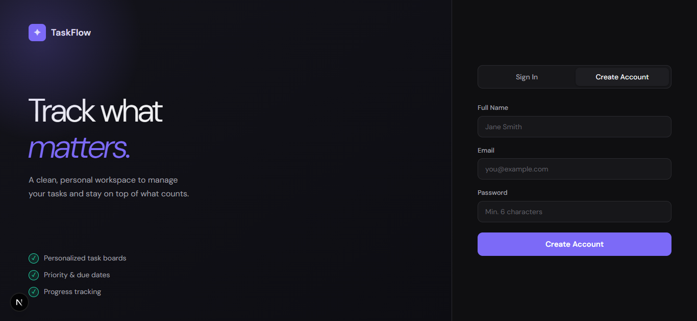
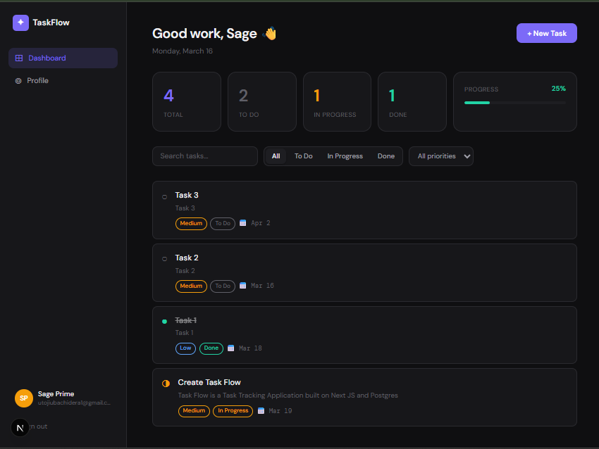
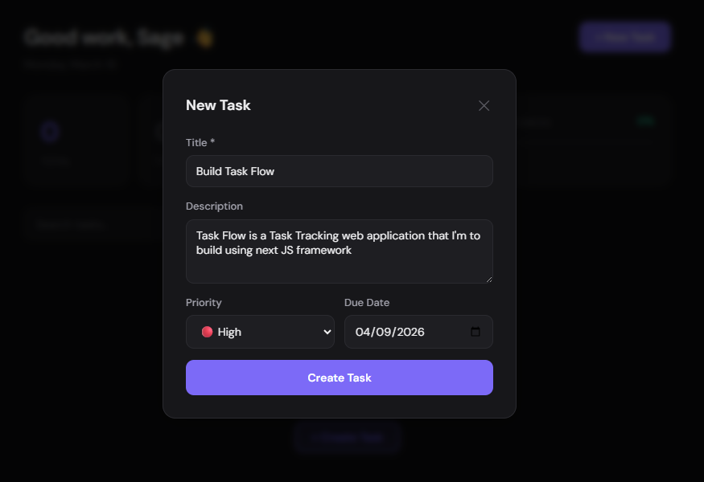
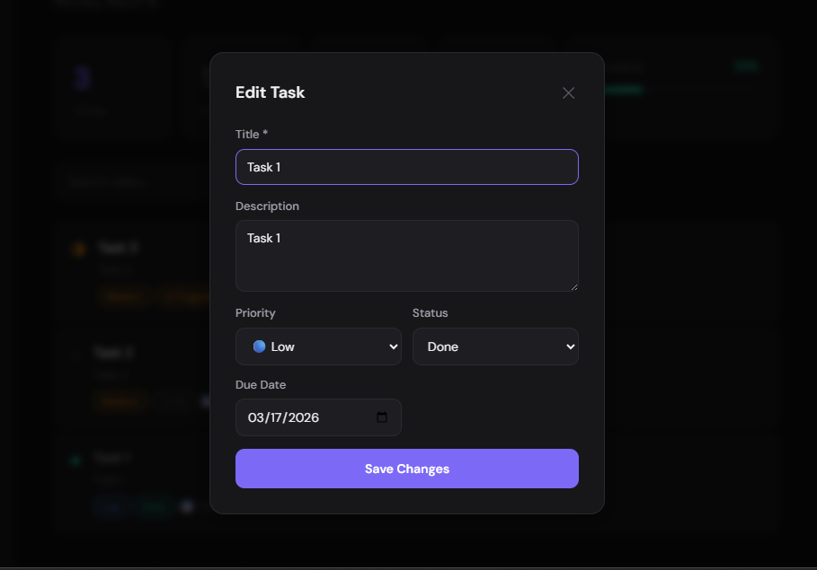
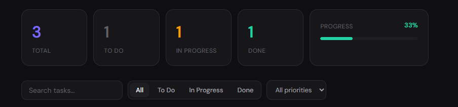
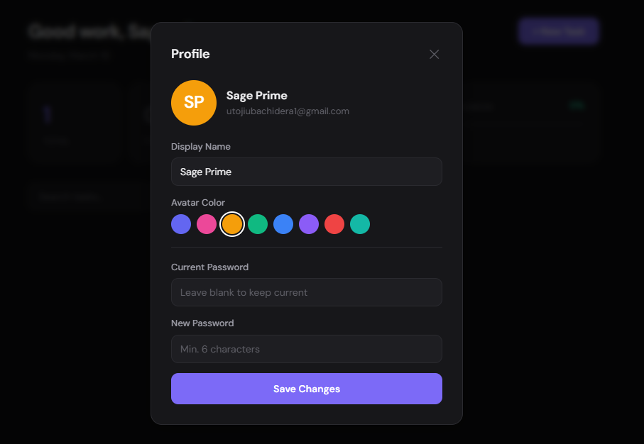

# ✦ TaskFlow — Personal Task Tracker

A clean, full-stack personal task management application built with **Next.js 15**, **PostgreSQL**, and **JWT-based authentication**. Each user has their own private workspace to create, organize, and track tasks by status and priority.

---

## 📸 Screenshots

### Authentication Page
> _Sign in or create a new account_



---

### Dashboard Overview
> _Your personal task board with live stats and progress_



---

### Creating a New Task
> _Add a title, description, priority level, and optional due date_



---

### Editing a Task
> _Update any field including status directly from the modal_



---

### Filtering Tasks
> _Filter by status (To Do, In Progress, Done) and priority, or search by title_



---

### Profile Settings
> _Update your display name, avatar color, and password_



---

## 🗂 Project Structure

_I generated the folder structure using the DRAW FOLDER STRUCTURE Vs Code extension_

└── 📁task_tracker
    │
    ├── 📁public                         # Static assets served at root URL
    │   ├── file.svg
    │   ├── globe.svg
    │   ├── next.svg
    │   ├── vercel.svg
    │   └── window.svg
    │
    ├── 📁screenshots                    # README screenshot images
    │   ├── auth-page.png
    │   ├── dashboard.png
    │   ├── edit-task-modal.png
    │   ├── new-task-modal.png
    │   ├── profile-modal.png
    │   └── task-filters.png
    │
    └── 📁src
        │
        ├── 📁app                        # Next.js App Router root
        │   │
        │   ├── 📁api                    # REST API route handlers (server-side only)
        │   │   │
        │   │   ├── 📁auth               # Authentication endpoints
        │   │   │   ├── 📁login
        │   │   │   │   └── route.js     # POST /api/auth/login — verify credentials, set JWT cookie
        │   │   │   ├── 📁logout
        │   │   │   │   └── route.js     # POST /api/auth/logout — clear JWT cookie
        │   │   │   └── 📁register
        │   │   │       └── route.js     # POST /api/auth/register — hash password, create user, set JWT cookie
        │   │   │
        │   │   ├── 📁profile
        │   │   │   └── route.js         # GET /api/profile — fetch user + task stats
        │   │   │                        # PATCH /api/profile — update name, avatar color, or password
        │   │   │
        │   │   └── 📁tasks
        │   │       ├── 📁[id]
        │   │       │   └── route.js     # PATCH /api/tasks/:id — update task fields
        │   │       │                    # DELETE /api/tasks/:id — delete a task
        │   │       └── route.js         # GET /api/tasks — list user's tasks (supports ?status= ?priority=)
        │   │                            # POST /api/tasks — create a new task
        │   │
        │   ├── 📁auth
        │   │   └── page.js              # /auth — login & register page (redirects if already logged in)
        │   │
        │   ├── 📁dashboard
        │   │   └── page.js              # /dashboard — server component, loads user + tasks from DB, renders Dashboard
        │   │
        │   ├── globals.css              # Global CSS reset, design tokens (CSS variables), scrollbar styles
        │   ├── layout.js                # Root layout — sets metadata, loads Google Fonts, wraps all pages
        │   └── page.js                  # / — root redirect: → /dashboard (authed) or → /auth (guest)
        │
        ├── 📁components                 # Reusable client-side UI components
        │   ├── AuthForm.js              # Login/register form with tab toggle, validation, and error display
        │   ├── AuthForm.module.css      # Styles for the split-panel auth layout
        │   ├── Avatar.js                # Initials-based circular avatar, color-configurable
        │   ├── Dashboard.js             # Full dashboard UI: sidebar, stats, filters, task list, profile modal
        │   ├── Dashboard.module.css     # Styles for dashboard layout, task rows, modals, badges
        │   └── TaskModal.js             # Create / edit task modal with title, description, priority, due date
        │
        └── 📁lib                        # Shared server-side utilities
            ├── auth.js                  # JWT sign/verify, session cookie read/write/clear (uses jose)
            ├── db.js                    # PostgreSQL connection pool singleton (node-postgres)
            ├── middleware.js            # requireAuth() — reads session, returns 401 if unauthenticated
            └── migrate.js              # One-time DB migration script — creates users & tasks tables + indexes
    │
    ├── .env.local                       # Environment variables: DATABASE_URL, JWT_SECRET (This will be omitted from github commit)
    ├── .gitattributes                   # Git line-ending rules
    ├── .gitignore                       # Ignores node_modules, .next, .env.local
    ├── eslint.config.mjs                # ESLint configuration
    ├── jsconfig.json                    # Path alias config (@/* → src/*)
    ├── next.config.js                   # Next.js config (CommonJS)
    ├── next.config.mjs                  # Next.js config (ESM) — use one or the other, not both
    ├── package-lock.json                # Exact dependency lockfile
    ├── package.json                     # Dependencies + npm scripts (dev, build, start, db:migrate)
    ├── postcss.config.js                # PostCSS config for Tailwind
    ├── README.md                        # Project documentation + setup guide
    └── tailwind.config.js               # Tailwind CSS configuration

---

## ⚙️ Tech Stack

| Layer | Technology |
|---|---|
| Framework | Next.js 15 (App Router) |
| Database | PostgreSQL |
| DB Client | `pg` (node-postgres) |
| Auth | JWT via `jose`, stored in HttpOnly cookies |
| Password Hashing | `bcryptjs` |
| Styling | CSS Modules |
| Fonts | DM Sans + DM Mono (Google Fonts) |

---

## 🗄️ Database Schema

### `users`

| Column | Type | Notes |
|---|---|---|
| `id` | UUID | Primary key, auto-generated |
| `name` | VARCHAR(255) | Display name |
| `email` | VARCHAR(255) | Unique, used for login |
| `password_hash` | VARCHAR(255) | bcrypt hash |
| `avatar_color` | VARCHAR(7) | Hex color for avatar |
| `created_at` | TIMESTAMPTZ | Auto-set on insert |
| `updated_at` | TIMESTAMPTZ | Auto-set on insert |

### `tasks`

| Column | Type | Notes |
|---|---|---|
| `id` | UUID | Primary key, auto-generated |
| `user_id` | UUID | Foreign key → `users.id` (CASCADE delete) |
| `title` | VARCHAR(500) | Required |
| `description` | TEXT | Optional |
| `status` | VARCHAR(20) | `todo` \| `in_progress` \| `done` |
| `priority` | VARCHAR(10) | `low` \| `medium` \| `high` |
| `due_date` | DATE | Optional |
| `created_at` | TIMESTAMPTZ | Auto-set on insert |
| `updated_at` | TIMESTAMPTZ | Updated on each PATCH |

### Indexes
- `idx_tasks_user_id` — fast lookup of all tasks per user
- `idx_tasks_status` — fast filtering by status
- `idx_tasks_priority` — fast filtering by priority

---

## 🚀 Getting Started

### Prerequisites

- Node.js 18+
- PostgreSQL 14+

### 1. Clone or copy the project

```bash
# If using git
git clone <https://github.com/Prime-02/task_tracker>
cd task-tracker

# Or just extract the ZIP into your folder
```

### 2. Install dependencies

```bash
npm install
```

### 3. Configure environment variables

Create a `.env.local` file in the project root:

```env
# Your PostgreSQL connection string
DATABASE_URL=request-for-url-here


# A long, random secret for signing JWT tokens
JWT_SECRET=request-for-secret-here

# App URL
NEXT_PUBLIC_APP_URL=http://localhost:3000
```

### 4. Create the database

```bash
# Using the psql CLI
createdb tasktracker

# Or inside psql
psql -U postgres -c "CREATE DATABASE tasktracker;"
```

### 5. Run migrations

```bash
node src/lib/migrate.js
```

Expected output:
```
Running migrations...
✅ Migrations complete!
```

### 6. Start the development server

```bash
npm run dev
```

Open [http://localhost:3000](http://localhost:3000) — you'll be redirected to the login page automatically.

---

## 🔐 Authentication Flow

1. User submits the register form → password is hashed with bcrypt → user row inserted → JWT signed and stored as an **HttpOnly cookie** (7-day expiry).
2. On every page load, the server component reads the cookie and verifies the JWT. If invalid or missing, the user is redirected to `/auth`.
3. All API routes call `requireAuth()` which verifies the JWT and returns the session payload (`userId`, `email`, `name`). Unauthenticated requests receive a `401`.
4. Logout clears the cookie and redirects to `/auth`.

---

## ✅ Features

### Task Management
- **Create** tasks with title, description, priority, and optional due date
- **Edit** any field including status via a modal
- **Delete** tasks with a single click
- **Cycle status** by clicking the status icon directly on a task row (To Do → In Progress → Done → To Do)

### Filtering & Search
- Filter tasks by **status**: All, To Do, In Progress, Done
- Filter tasks by **priority**: All, High, Medium, Low
- **Search** tasks by title in real time

### Stats & Progress
- Live counts for total, to-do, in-progress, and done tasks
- **Progress bar** showing percentage of completed tasks

### Profile
- Update **display name**
- Choose an **avatar color** from a color picker
- Change **password** (requires current password confirmation)

---

## 🌐 API Reference

### Auth

| Method | Endpoint | Body | Description |
|---|---|---|---|
| POST | `/api/auth/register` | `{ name, email, password }` | Create account + set session cookie |
| POST | `/api/auth/login` | `{ email, password }` | Login + set session cookie |
| POST | `/api/auth/logout` | — | Clear session cookie |

### Tasks

| Method | Endpoint | Description |
|---|---|---|
| GET | `/api/tasks` | List all tasks for the logged-in user. Supports `?status=` and `?priority=` query params |
| POST | `/api/tasks` | Create a new task |
| PATCH | `/api/tasks/:id` | Update a task (any field) |
| DELETE | `/api/tasks/:id` | Delete a task |

### Profile

| Method | Endpoint | Description |
|---|---|---|
| GET | `/api/profile` | Get profile + task count stats |
| PATCH | `/api/profile` | Update name, avatar color, or password |

---

## 📄 License

MIT — free to use, modify, and distribute.